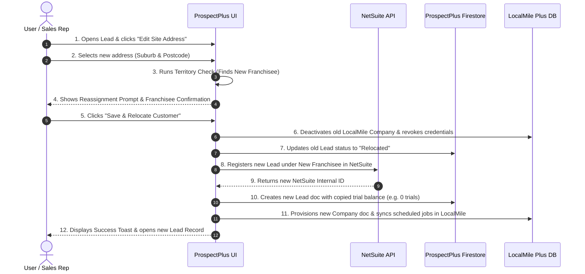

# Implementation Plan - Lead/Customer Address Change & Franchisee Reassignment LocalMile Sync

This document details both the **User Step-by-Step Process** and the underlying **Technical Implementation** for handling lead and signed customer address changes when relocating to a new Franchisee ("zee") territory.

---

## User Step-by-Step Process (End-User Experience)

When an admin, account manager, or sales representative updates the site address of a lead or signed customer in ProspectPlus:

### Detailed User Workflow Steps:

1. **Open Customer Profile & Edit Address**:
   - User opens an active Lead or Signed Customer profile in ProspectPlus.
   - User clicks **"Edit Site Address"** to open the address modification dialog.

2. **Enter New Address**:
   - User types the new address into the autocomplete field.
   - ProspectPlus automatically evaluates the suburb and postcode against franchisee territory maps.

3. **Franchisee Territory Match Detection**:
   - If the new address belongs to the **same Franchisee**, standard address updating occurs.
   - If the new address belongs to a **different Franchisee ("zee")**:
     - The UI displays a **Relocation & Reassignment Alert**:
       > *"Notice: This address is serviced by **[New Franchisee Name]**. Saving will reassign the customer, stop the existing LocalMile company account, create a new lead record under **[New Franchisee Name]**, and copy all existing trial & service settings."*

4. **Confirm Relocation**:
   - User reviews the matched franchisee details and clicks **"Save & Relocate Customer"**.

5. **Automated Background Sequence (No Manual Re-entry Needed)**:
   - **Old Account Deactivation**: The existing company record in LocalMile database (`localmile-plus` project) is stopped, active scheduled jobs are cancelled, and user login access for old contacts is revoked.
   - **Old Record Tracking**: The old lead record in ProspectPlus is updated with status `Relocated / Franchisee Reassigned` and linked to the new lead ID.
   - **New NetSuite Lead Creation**: A new lead record is registered in NetSuite under the new Franchisee and assigned a new numeric NetSuite ID.
   - **Trial & Settings Inheritance**: The new lead record inherits the exact free trial balance from the old record (e.g. if the old account had 0 free trials remaining, the new account retains 0 free trials; trial credits are not reset).
   - **New LocalMile Company Provisioning**: The new company document is created in the LocalMile database (`companies/{newLeadId}`) with the new Franchisee ID, copied trial balance, and synced scheduled services.

6. **Success Confirmation & Navigation**:
   - User receives a success toast: *"Customer successfully relocated to [New Franchisee Name]. New Lead ID: #XXXXX created with copied LocalMile settings."*
   - ProspectPlus opens/redirects to the newly created Lead record.

---

## User Review Required

> [!IMPORTANT]
> **Free Trial Balance Preservation Logic:**
> When copying the old company account state to the new company account:
> - If `localMileTrialsRemaining` on the old lead is `0` (or `hasCreatedJob: true` with no remaining trials), the new lead's `localMileTrialsRemaining` and LocalMile's `trial_credits_balance` will be set to `0` (preventing accidental resets back to 5 default trial credits).
> - If `localMileTrialsRemaining` is `N` (where N > 0), the new lead will preserve `N` trial credits.

> [!NOTE]
> **NetSuite Lead Re-Keying & ID Creation:**
> The new lead record is registered with NetSuite under the new Franchisee internal ID. Upon successful NetSuite creation, the lead document is re-keyed to the numeric NetSuite Internal ID and synced to LocalMile database with the new ID as the primary company identifier (`companyId`).

---

## Technical Proposed Changes

### Core Services & Logic Layer

#### [NEW] [lead-relocation-service.ts](file:///Users/ankithravindran/Development/Antigravity/prospectplus-application/src/services/lead-relocation-service.ts)
- Create a server service module `processLeadAddressChangeAndRelocation` to manage the complete relocation workflow:
  - **Step 1 (Snapshot Old Lead)**: Fetch old lead/company document along with subcollections (`contacts`, `services`, `scheduledServices`, `localMileJobs`). Read trial state (`localMileTrialsRemaining`, `hasCreatedJob`, `trial_credits_balance`).
  - **Step 2 (Deactivate Old LocalMile Account)**:
    - Invoke `deactivateLocalMileAccessForLead(oldLeadId)` to revoke external user accounts in LocalMile.
    - Set status of old company doc in LocalMile database (`localmile-plus` Firestore `companies/{oldLeadId}`) to inactive / stopped.
    - Cancel active scheduled jobs for `oldLeadId` in LocalMile.
    - Update old lead in ProspectPlus with status `Relocated / Franchisee Reassigned` and cross-reference note to new lead ID.
  - **Step 3 (Create New Lead in NetSuite & ProspectPlus)**:
    - Construct new lead payload with new address and new Franchisee details.
    - Copy trial fields (`localMileTrialsRemaining`, `hasCreatedJob`, etc.) directly from old lead snapshot.
    - Trigger `sendNewLeadToNetSuite` / `rekeyLeadToNetSuite` to establish new numeric lead ID.
    - Copy contacts and active service configurations into new lead subcollections.
  - **Step 4 (Sync New Company to LocalMile Database)**:
    - Provision document `companies/{newLeadId}` in `localmile-plus` Firestore project with new Franchisee ID and copied `trial_credits_balance`.
    - Sync PMPO / scheduled services to `companies/{newLeadId}/scheduled_jobs` via `syncPmpoToLocalMileServer`.
    - Record cross-reference activity log on new lead document.

#### [MODIFY] [localmile-db.ts](file:///Users/ankithravindran/Development/Antigravity/prospectplus-application/src/lib/localmile-db.ts)
- Add utility methods to update/deactivate company documents directly in the `localmile-plus` Firestore database:
  - `deactivateLocalMileCompanyDoc(companyId: string)`: Updates company status to inactive/stopped in LocalMile `companies` collection.
  - `createOrCopyLocalMileCompanyDoc(newCompanyId: string, copyData: any)`: Creates or updates the new company doc in LocalMile with copied trial balance and franchisee ID.

#### [MODIFY] [localmile-sync-server.ts](file:///Users/ankithravindran/Development/Antigravity/prospectplus-application/src/services/localmile-sync-server.ts)
- Enhance `syncPmpoToLocalMileServer` to accept explicit `trial_credits_balance` parameter to ensure synchronized job creation respects inherited trial limits.

---

### API Layer & UI Components

#### [NEW] [route.ts](file:///Users/ankithravindran/Development/Antigravity/prospectplus-application/src/app/api/leads/relocate/route.ts)
- Create API route `POST /api/leads/relocate` that accepts `{ leadId, newAddress, newFranchiseeId, newFranchiseeName }`.
- Executes `processLeadAddressChangeAndRelocation` safely on the server with admin permissions.

#### [MODIFY] [edit-address-dialog.tsx](file:///Users/ankithravindran/Development/Antigravity/prospectplus-application/src/components/edit-address-dialog.tsx)
- Update `EditAddressDialog` submit handler:
  - Detect when an address edit involves a Franchisee change (`matchedFranchisees` single match different from current franchisee, or manually selected new franchisee).
  - Provide a clear UI prompt confirming relocation & franchisee reassignment: "Changing address to a new territory will reassign this account to **[New Franchisee]**, stop the existing LocalMile company account, create a new record, and copy over trial & service settings."
  - Invoke `POST /api/leads/relocate` on confirmation.

---

## Verification Plan

### Automated Tests
- Build & Lint check: `npm run build` / static analysis.
- Verify TypeScript types for relocation payload and LocalMile DB integration.

### Manual Verification
1. **Address Change Trigger**:
   - Open a lead/customer with an existing LocalMile account and 0 remaining free trials (or active trial).
   - Change site address in `EditAddressDialog` to a suburb matching a different Franchisee.
2. **Old Account Deactivation Verification**:
   - Confirm old lead in ProspectPlus receives activity log and status update.
   - Verify `deactivateLocalMileAccessForLead` is called for old contacts.
   - Verify old company doc in `localmile-plus` Firestore is marked inactive / stopped.
3. **New Account Creation & Trial Copy Verification**:
   - Verify new lead is created with new NetSuite Internal ID under new Franchisee.
   - Verify `localMileTrialsRemaining` on new lead equals old lead's remaining trial count (e.g. 0).
   - Verify new company doc in LocalMile DB (`localmile-plus` project `companies/{newLeadId}`) exists with `trial_credits_balance` copied from old account.
   - Confirm scheduled jobs / services are synced to new LocalMile company ID.
