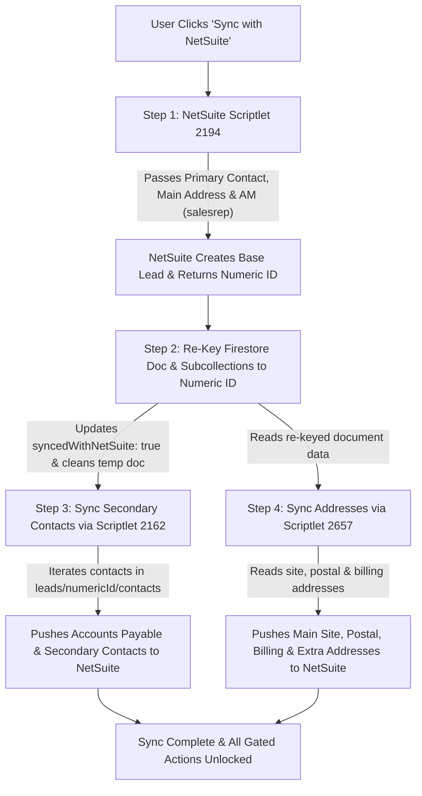

# Implementation Plan - On-Demand NetSuite Lead Sync, Multi-Contact/Address Sync & Performance Optimization

Transition NetSuite lead synchronization (Scriptlet 2194) from automatic creation to an **on-demand manual action** ("Sync with NetSuite"). All leads created via inbound website forms, CRM manual forms, or multi-site child site creation will be created locally in Firestore first. NetSuite update/outcome APIs will be guarded for unsynced leads, and sales deal workflows (SCF quotes, SOFs, status conversions) will be gated until NetSuite synchronization is completed.

---

## ⚡ Impact on Performance & Speed

> [!TIP]
> **YES! This change will make lead creation dramatically faster for both website visitors and CRM users.**

### Performance Comparison:

| Metric / Scenario | Previous Behavior (Automatic NetSuite Sync) | New Proposed Behavior (Local Creation First) |
| :--- | :--- | :--- |
| **Inbound Website Form (`/api/leads`)** | **2.5s – 10s+** (Blocked waiting for external NetSuite HTTP request to Scriptlet 2194 + 1.5s post-sync sleep) | **~150ms – 300ms** (Instant Firestore write via Firebase Admin SDK; no NetSuite network roundtrip) |
| **CRM Manual Lead Form (`NewLeadForm`)** | **2s – 8s** (Blocked UI button spinner while contacting NetSuite API) | **~100ms – 200ms** (Instant modal closure & immediate UI redirect) |
| **Multi-Site Site Creation (`createChildSiteLead`)** | **3s – 8s** per child site created | **~150ms** per child site created |
| **Resilience to NetSuite Downtime/Timeouts** | **High risk:** If NetSuite is slow, lagging, or timing out (60s limit), website forms & CRM creation stall or error out | **Zero risk on creation:** Form submissions never fail due to NetSuite API slowness. NetSuite communication happens strictly on-demand later. |

---

## 🏙️ Franchisee Territory Matching & ID Rules

When a lead is created locally in Firestore, the lead's site address (**suburb**, **postcode**, and **state**) is matched against `territoryJson` of all documents in the `franchisees` collection:

| Territory Match Result | Assigned Franchisee ID (`franchiseeInternalId` / `franchisee_id`) | Assigned Franchisee Name (`franchiseeName` / `franchisee`) | Lead Status Adjustment |
| :--- | :--- | :--- | :--- |
| **1-to-1 Match** (Exactly 1 franchisee matches suburb + postcode + state) | **Franchisee Document ID** (`doc.id` or `data.internalId`) | **`doc.data().name`** field | Website leads: **`"Hot Lead"`** CRM leads: `"New"` |
| **> 1 Match** (Multiple franchisees service the territory) | `"435"` | `"MailPlus Pty Ltd"` | Website leads: **`"Hot Lead"`** CRM leads: `"New"` (Stores `potentialFranchisees` array) |
| **0 Matches** (No franchisee services the territory) | `"435"` | `"MailPlus Pty Ltd"` | **`"Out of Territory"`** across all creation sources |

---

## 👤 Account Manager Assignment & NetSuite Transfer

When creating a lead in Firestore, an **Account Manager** is assigned automatically or manually according to these rules:

### Assignment Logic:
1. **Multi-Site Campaigns / Child Leads:** Automatically assigned to the Multisite Account Manager (`MULTISITE_ACCOUNT_MANAGER_UID`).
2. **Specified AM in Request:** If an AM UID or display name is provided, the backend fetches the user profile from `users` collection to extract display name, email, and Calendly link.
3. **Automatic Round-Robin Assignment:** If no AM is specified, the system queries active users in the `users` collection with `assignedRoles` containing `'Account Manager'`, filtering out users currently on leave (`canAssignToAm`). An Account Manager is randomly/round-robin assigned.

### Passing to NetSuite Scriptlet 2194:
When **"Sync with NetSuite"** is executed:
- The assigned Account Manager display name / ID is passed as URL query parameter **`salesrep`** (and `accountManagerAssigned`) to NetSuite Scriptlet `2194`.
- NetSuite assigns the lead to the matching sales rep in NetSuite.

---

## 📊 Newly Created Lead Status Matrix by Creation Source

| Creation Source / Channel | Status (1 or >1 Franchisee Match) | Status (0 Franchisee Matches) | Primary Bucket |
| :--- | :--- | :--- | :--- |
| **MailPlus Website Inbound API (`/api/leads`)** | **`"Hot Lead"`** | **`"Out of Territory"`** | `bucket: "inbound"` |
| **Website 5 Free Collections Trial Form** | **`"Hot Lead"`** | **`"Out of Territory"`** | `bucket: "5-free-trial"` / `inbound` |
| **CRM Manual Lead Form (`NewLeadForm`)** | `"New"` (or user-selected status) | **`"Out of Territory"`** | User-selected bucket |
| **CRM Quick Add Dialog (`QuickAddLeadDialog`)** | `"New"` | **`"Out of Territory"`** | Selected bucket |
| **Multi-Site Child Location (`createChildSiteLead`)** | `"New"` | **`"Out of Territory"`** | `bucket: "multisite"` |
| **Multi-Franchisee Child Lead** | `"New"` | **`"Out of Territory"`** | Linked child bucket |
| **LPO Network Lead Conversion** | `"Lead Created"` | **`"Out of Territory"`** | `bucket: "lpo_network"` |

---

## 🔍 Comprehensive Audit of NetSuite & Integration APIs

Below is the complete list of all NetSuite Scriptlets and integration endpoints across the codebase, along with the required guard behavior for unsynced leads:

| API / Proxy Service | NetSuite Scriptlet | What it does | Behavior for Unsynced Leads (`syncedWithNetSuite: false`) |
| :--- | :--- | :--- | :--- |
| **Lead Creation** | Scriptlet `2194` | Base Lead creation & ID generation | **Bypassed during creation.** Executed ONLY when user clicks "Sync with NetSuite". |
| **Contact Sync** | Scriptlet `2162` | Secondary / AP contact creation | **Bypassed.** Runs in Step 3 of manual NetSuite sync after document re-keying. |
| **Address Sync** | Scriptlet `2657` | Site, Postal & Billing address sync | **Bypassed.** Runs in Step 4 of manual NetSuite sync after document re-keying. |
| **Lead Updates** | Scriptlet `2165` | Company/Lead profile updates | **Guarded.** Saves updates locally in Firestore; skips NetSuite HTTP request. |
| **Customer Updates** | Scriptlet `1900` | Signed customer updates | **Guarded.** Saves updates locally in Firestore; skips NetSuite HTTP request. |
| **Call Outcome Sync** | Scriptlet 1900/Scriptlet | Logs dialer/call outcome to NetSuite | **Guarded.** Logs activity in Firestore `activity` subcollection; skips NetSuite call. |
| **Activity Logging** | Activity Scriptlet | Logs notes, emails & calls | **Guarded.** Saves activity in Firestore; skips NetSuite HTTP request. |
| **LocalMile / MP Products Trial** | Scriptlet `2305` | Initiates 5 Free Collections / LocalMile trial | **Gated.** Action blocked until lead is synced with NetSuite. |
| **Service Selection** | Scriptlet `2188` | Saves selected service options | **Guarded.** Saves service selections in Firestore `discoveryData`; skips NetSuite call. |
| **Visit Notes & Field Sales** | Scriptlet `2195` | Logs field sales visits | **Guarded.** Saves visit note in Firestore `visit_notes` subcollection; skips NetSuite call. |
| **Schedule / Signup Proxy** | Scriptlet `2191` / `2192` | Schedules appointments & signups | **Guarded.** Saves schedule in Firestore; skips NetSuite call. |
| **SCF Quotes & SOF Contracts** | Scriptlet `2187` / `2190` | Generates official quotes & contracts | **Gated.** Action blocked in UI until lead is synced with NetSuite. |
| **AirCall Webhooks** | `/api/aircall` | Ingests AirCall call logs | **Fully functional.** Logs call data to Firestore `activity` subcollection without requiring NetSuite. |
| **Campaigns & Email Dispatch** | `/api/campaigns` | Sends marketing emails & SMS | **Fully functional.** Uses SendGrid/Twilio and logs directly to Firestore. |

---

## 📇 Multi-Contact, Billing & Multi-Address NetSuite Sync Flow

When a lead contains **multiple contacts**, **billing address**, **postal address**, or **multiple site addresses**, NetSuite sync runs as a coordinated 4-step process upon clicking **"Sync with NetSuite"**:

### Detailed Sync Sequence:

1. **Step 1: Base Lead Creation in NetSuite (Scriptlet 2194)**
   - Sends Company Name, Primary Contact details, Main Site Address, Campaign, Franchisee details (`franchisee_id`), and Account Manager (`salesrep`) to NetSuite Scriptlet `2194`.
   - NetSuite provisions and returns the official numeric **NetSuite Internal ID** (e.g. `184920`).

2. **Step 2: Immediate Firestore Document Re-Keying & Status Update**
   - Immediately copy document data and subcollections (`contacts`, `addresses`, `activity`, etc.) from the temporary alphanumeric ID (e.g. `MP123456`) to the new numeric NetSuite ID `leads/{newNumericId}` in Firestore.
   - Set `syncedWithNetSuite: true`, `netSuiteSyncStatus: 'synced'`, and `internalid: newNumericId`.
   - Delete the old temporary document `leads/MP123456`.
   - *This ensures that all subsequent API calls and background sync tasks interact directly with the official numeric Firestore document `leads/{newNumericId}`.*

3. **Step 3: Sync Secondary & Accounts Payable Contacts (Scriptlet 2162)**
   - Query contacts from `leads/{newNumericId}/contacts`.
   - For every secondary contact (or Accounts Payable contact), call NetSuite Contact Scriptlet **`2162`** (`sendContactToNetSuite`) using `newNumericId`, passing `contactid`, `isPrimary`, `isAccountsPayable`, `email`, `phone`, `title`, and app permissions (`localmile`, `shipmate`).

4. **Step 4: Sync Multi-Address: Site, Postal & Billing (Scriptlet 2657)**
   - Call `sendAddressUpdateToNetSuite(newNumericId)`, invoking NetSuite Address Scriptlet **`2657`** against `leads/{newNumericId}`.
   - Syncs:
     - **Main Site Address** (street, city, state, zip, lat/lng)
     - **Postal Address** (`postal_addr1`, `postal_city`, `postal_state`, `postal_zip`, `postal_country`)
     - **Billing Address** (tagged appropriately)
     - **Additional Site Addresses** in the `addresses` subcollection.

---

## NetSuite Scriptlet 2194 Parameter Reference

When a user clicks **"Sync with NetSuite"** (or during manual sync execution), NetSuite API Scriptlet `2194` is called with the following URL parameters:

| Parameter Name | Description | Source Field |
| :--- | :--- | :--- |
| `script` | NetSuite Script ID (`2194`) | Fixed (`2194`) |
| `deploy` | NetSuite Deployment ID (`1`) | Fixed (`1`) |
| `compid` | NetSuite Account ID (`1048144`) | Fixed (`1048144`) |
| `ns-at` | Security Token | Fixed System Token |
| `companyname` | Business / Company Name | `lead.companyName` |
| `website` | Company Website URL | `lead.websiteUrl` |
| `phone` | Main Phone Number | `lead.customerPhone` |
| `email` | Customer Service Email | `lead.customerServiceEmail` |
| `custentity_abn` | Australian Business Number | `lead.abn` |
| `category` | Industry Category | `lead.industryCategory` |
| `custentity_leadsource` | Campaign / Lead Source Name | `lead.campaign` |
| `billaddr1` | Street Address / Address Line 1 | `lead.address.street` / `lead.address.address1` |
| `billaddr2` | Address Sub-unit / Suite / Unit | `lead.address.address1` |
| `billcity` | Suburb / City | `lead.address.city` |
| `billstate` | State Abbreviation (e.g. `NSW`, `VIC`) | `getShorthandState(lead.address.state)` |
| `billzip` | Postcode | `lead.address.zip` |
| `billcountry` | Country (default `Australia`) | `lead.address.country` |
| `custentity_primary_contact_name` | Full Primary Contact Name | `${contact.firstName} ${contact.lastName}` |
| `custentity_primary_contact_firstname` | First Name | `contact.firstName` |
| `custentity_primary_contact_lastname` | Last Name | `contact.lastName` |
| `custentity_primary_contact_title` | Job Title | `contact.title` |
| `custentity_primary_contact_email` | Contact Email | `contact.email` |
| `custentity_primary_contact_phone` | Contact Phone / Mobile | `contact.phone` |
| `franchisee_id` | Territory Franchisee Document ID | `lead.franchiseeInternalId` / `lead.franchisee_id` |
| `franchisee_name` | Territory Franchisee `name` field value | `lead.franchiseeName` / `lead.franchisee` |
| `salesrep` | Assigned Account Manager / Sales Rep | `lead.salesRepAssigned` / `lead.accountManagerAssigned` |
| `custentity_dialer` | Assigned Dialer Rep | `lead.dialerAssigned` |
| `bucket` | Pipeline Bucket (`inbound`, `lpo_network`, etc.) | `lead.bucket` |
| `custentity_checkin_questions` | Formatted Discovery Questions | `lead.discoveryData` |
| `weekly_parcels` | Weekly Parcel Volumes | `lead.discoveryData.weeklyParcels` |
| `parent` / `parent_id` / `custentity_parent_id` | Parent Lead NetSuite ID (if multi-site child) | `lead.parentLeadId` |
| `custentity_lpo_lead_id` / `lpoLeadId` | Linked LPO Lead ID (if applicable) | `lead.lpoLeadId` |
| `page_url` / `custentity_page_url` | Source Landing Page URL | `lead.inboundPageUrl` / `lead.pageUrl` |

---

## User Review Required

> [!IMPORTANT]
> **Workflow Behavioral Changes:**
> 1. **Immediate NetSuite Sync Removal (Steps 1, 2, & 3):**
>    - Inbound API website submissions (`/api/leads`), CRM manual lead creations (`createNewLead`), and Multi-Site child lead creations (`createChildSiteLead`) will NO LONGER invoke NetSuite API `2194` upon creation.
>    - Leads will be created directly in Firestore with `syncedWithNetSuite: false` and a ProspectPlus ID (`MPxxxxxx` or auto-generated ID).
> 2. **Sales Deal & Contract Gating:**
>    - Users CANNOT perform sales deals (creating SCF quotes, generating SOF contracts, or moving lead status to `Won` / `Signed`) until the lead is synced with NetSuite (`syncedWithNetSuite === true`).
>    - UI will display a prominent banner and disable sales deal actions with a prompt: *"Sync with NetSuite to enable Sales Deals & Quotes"*.
> 3. **NetSuite API Execution Guarding:**
>    - NetSuite update scriptlets (for editing company info, editing/adding addresses, editing/adding contacts, logging call outcomes, adding activities) will check if the lead is synced with NetSuite first. If `syncedWithNetSuite !== true` or lead ID is non-numeric, NetSuite API calls will be safely bypassed to prevent runtime failure.

---

## Proposed Changes

---

### Backend Lead Creation & NetSuite Services

#### [MODIFY] [route.ts](file:///Users/ankithravindran/Development/Antigravity/prospectplus-application/src/app/api/leads/route.ts)
- **Step 1 (Inbound API / Website Submissions):**
  - Remove call to `sendNewLeadToNetSuite(netSuitePayload)`.
  - Perform territory matching against `franchisees` collection using suburb (`city`), postcode (`zip`), and state (`state`).
  - Use `doc.id` for franchisee ID and `doc.data().name` for franchisee name.
  - Set initial status to **`"Hot Lead"`** if 1 or >1 franchisee matches, or **`"Out of Territory"`** if 0 matches.
  - Assign Account Manager via round-robin/random lookup from `users` collection with role `'Account Manager'`.
  - Save lead document directly in Firestore (`leads` collection) with `syncedWithNetSuite: false`.

#### [MODIFY] [firebase.ts](file:///Users/ankithravindran/Development/Antigravity/prospectplus-application/src/services/firebase.ts)
- **Step 2 (Manual UI Lead Creation):**
  - Update `createNewLead(data)` and `findFranchiseeForAddress()` to return `doc.id` as `internalId` and `doc.data().name` as `name`.
  - Assign Account Manager automatically if unassigned.
  - Create Firestore lead document directly with `syncedWithNetSuite: false`.
- **Step 3 (Multi-Site Child Site Creation & Multi-Franchisee Creation):**
  - Update `createChildSiteLead()` and `createMultiFranchiseeChildLead()` with territory rules, assign Account Manager, and create child leads directly in Firestore with `syncedWithNetSuite: false`.

#### [MODIFY] [netsuite.ts](file:///Users/ankithravindran/Development/Antigravity/prospectplus-application/src/services/netsuite.ts)
- Add a helper function `isLeadSyncedWithNetSuite(leadId: string)` (checks if `leadId` is numeric `/^\d+$/`).
- **Guard NetSuite Update Functions:**
  - `sendLeadUpdateToNetSuite`: Bypass NetSuite fetch if `leadId` is non-numeric, returning `{ success: true, message: 'Lead not synced with NetSuite. Update saved locally.' }`.
  - `sendAddressUpdateToNetSuite`: Bypass background address sync scriptlet if `leadId` is non-numeric.
  - `sendContactToNetSuite`: Bypass NetSuite fetch if `leadId` is non-numeric.
  - `sendToNetSuiteForOutcome`: Bypass NetSuite scriptlet if `leadId` is non-numeric.
  - `sendNoteToNetSuite`, `sendActivityToNetSuite`, `sendCompanyCustomerUpdateToNetSuite`: Add non-numeric guards.

#### [MODIFY] Proxy Services (`netsuite-localmile-proxy.ts`, `netsuite-visit-note-proxy.ts`, `netsuite-services-proxy.ts`, etc.)
- Add non-numeric guards to all proxy endpoints.
- If `leadId` is unsynced:
  - For local-first actions (visit notes, service selections): Save locally in Firestore and bypass NetSuite HTTP call.
  - For NetSuite-dependent actions (LocalMile trial initiation, SCF/SOF creation): Reject with a clear user prompt: *"Please sync lead with NetSuite first."*

#### [MODIFY] [rekey-lead.ts](file:///Users/ankithravindran/Development/Antigravity/prospectplus-application/src/services/rekey-lead.ts)
- Enhance `rekeyLeadToNetSuite(leadId)` to execute the complete 4-step sequence:
  1. Call Scriptlet **`2194`** with Primary Contact, Main Site Address, stored `franchiseeInternalId` / `franchiseeName`, and assigned Account Manager (`salesrep`) -> obtain NetSuite Internal ID (`newNumericId`).
  2. **Immediately re-key Firestore document and subcollections to `leads/{newNumericId}`**, set `syncedWithNetSuite: true`, and clean up the temporary document `leads/{leadId}`.
  3. Iterate through contacts in `leads/{newNumericId}/contacts` and push secondary / Accounts Payable contacts to NetSuite via Scriptlet **`2162`** (`sendContactToNetSuite`).
  4. Invoke `sendAddressUpdateToNetSuite(newNumericId)` to push site address, postal address, billing address, and additional site locations to NetSuite via Scriptlet **`2657`**.

---

### Frontend UI & Sales Deal Restrictions

#### [MODIFY] [lead-profile.tsx](file:///Users/ankithravindran/Development/Antigravity/prospectplus-application/src/components/lead-profile.tsx)
- **NetSuite Sync Banner & Status Badge:**
  - If `!lead.syncedWithNetSuite` or lead ID is non-numeric, render an alert banner:
    > ⚠️ **NetSuite Sync Required:** This lead is stored locally and has not been synced with NetSuite yet. Click **"Sync with NetSuite"** above to assign a NetSuite Internal ID and unlock sales deals, quotes, and contracts.
- **Sales Deal & Quote Gating:**
  - Disable "Create SCF Quote", "Generate SOF Contract", "LocalMile Trial Initiation", and status changes to `Won` / `Signed` when `!lead.syncedWithNetSuite`.
  - Display a tooltip / message on hover: *"You must sync this lead with NetSuite before creating sales deals or contracts."*

---

## Verification Plan

### Automated & Manual Verification
1. **Website Lead "Hot Lead" Status & Franchisee ID Test:**
   - Submit a lead via `POST /api/leads` with a site address matching 1 franchisee.
   - Verify assigned Franchisee ID is `doc.id` and Franchisee Name is `doc.data().name`.
   - Verify initial status is **`"Hot Lead"`**.
   - Verify Account Manager is assigned and saved.

2. **Unmatched Territory "Out of Territory" Test:**
   - Submit a lead with 0 matching franchisees.
   - Verify assigned Franchisee ID is `"435"`, name is `"MailPlus Pty Ltd"`, and initial status is **`"Out of Territory"`**.

3. **Inbound Form Performance Test (Step 1):**
   - Call `POST /api/leads` with a sample lead payload.
   - Measure response latency (expecting ~150-300ms vs previous 3s-10s).
   - Verify lead document is created in Firestore `leads` collection with `syncedWithNetSuite: false`.

4. **Multi-Contact, Multi-Address & Account Manager NetSuite Sync Test (Manual Sync):**
   - Create a lead with assigned Account Manager, contacts, and addresses.
   - Click **"Sync with NetSuite"**.
   - Verify:
     - Scriptlet **`2194`** is called first with `salesrep = accountManagerName`.
     - **Firestore document is re-keyed to the numeric NetSuite ID immediately.**
     - Scriptlet **`2162`** is called for secondary contacts using the new numeric ID.
     - Scriptlet **`2657`** is called for site, postal, and billing addresses using the new numeric ID.
     - `syncedWithNetSuite` is `true`.

5. **Sales Deal Gating Test:**
   - Attempt to click "Create SCF Quote" or "Generate SOF" on an unsynced lead profile.
   - Verify action is blocked and user is prompted to click "Sync with NetSuite".
