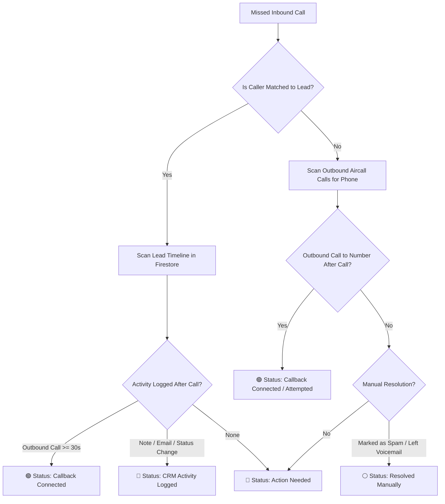

# MailPlus ProspectPlus CRM
## Inbound & Missed Calls Tracking & Follow-Up Guide
**Standard Operating Procedure, Activity Tracking & Management Reporting**

---

## 1. Executive Overview & Purpose

In high-velocity sales and business logistics management, unreturned inbound calls represent lost revenue, customer dissatisfaction, and missed opportunities. The **ProspectPlus** telephony tracking integration bridges Aircall call data with CRM intelligence to provide real-time visibility across all inbound phone lines.

### Core Data Dimensions Tracked:
1. **Call & Lead Attribution**: Identifies caller phone numbers, the specific Aircall line contacted, line owners, and matches them to Prospect+ Leads or Companies.
2. **Activity Timeline (When Call Happened vs. When Followed Up)**: Compares the exact timestamp of the incoming missed call against the timestamp and response time of subsequent callbacks or CRM activities.
3. **Management Accountability & SLAs**: Live follow-up rates (%), average response times (Time-to-Callback), and automated alerts for unaddressed calls requiring action.

> **Core Operating Philosophy: Zero Missed Opportunities**  
> Every missed inbound call must have a recorded follow-up action within the defined SLA window. Whether resolved via a connected callback, an email touchpoint, a CRM activity note, or a manual status classification, ProspectPlus ensures 100% accountability across all team members.

---

## 2. How Activity & Follow-Up Tracking Works (3-Tier Engine)

ProspectPlus does not rely solely on manual checklists. Instead, it utilizes an automated 3-tier detection engine that cross-references telephony data, CRM event streams, and manual agent input:

### Tier 1: Automated Outbound Callback Detection (Aircall Sync)
* When an inbound call is missed, the engine monitors subsequent outbound calls placed from any Aircall user to that caller’s phone number.
* If an outbound call is detected after the missed call timestamp:
  * **🟢 Callback Connected**: Outbound call answered with active duration (e.g. `Callback Connected: 2m 45s by Alex Mabuda in 14m`).
  * **🟡 Callback Attempted**: Outbound call dialed but unanswered or went to voicemail (e.g. `Callback Attempted: No Answer in 22m by Sarah Hart`).

### Tier 2: CRM Lead Activity Cross-Referencing
* If the incoming phone number matches an existing Lead or Company in Prospect+, the engine scans the lead’s activity timeline for any action logged after the call:
  * **🔵 Email Touchpoints**: Sent introduction or follow-up email logged via Prospect+ or synced mailbox.
  * **🔵 Notes & CRM Calls**: Manual call notes, voicemails left, or status progress updates logged on the lead profile.
  * **🔵 Meetings Scheduled**: Appointments, onboarding dates, or demonstrations booked for the client.

### Tier 3: Manual Resolution & SLA Override
* When an action is taken outside automated tracking (e.g., WhatsApp message, internal discussion with Operations, or spam call identification), reps and managers can click **"Resolve"** directly in the reporting table.
* This updates the report and logs a permanent audit note to the lead timeline.

---

## 3. Follow-Up Status Categories & Indicators

| Status Badge | Trigger Condition | System Meaning & Impact | Next Action Required |
| :--- | :--- | :--- | :--- |
| 🔴 **Action Needed (Unreturned)** | Missed call received with no outbound callback or CRM activity recorded. | The caller is waiting for a response. Live elapsed timer counts waiting time. | Rep must click **"Call"** to dial or **"Resolve"** to log touchpoint. |
| 🟢 **Callback Connected** | Outbound call placed to caller and answered (duration > 0s). | Call successfully returned. Response time in minutes is logged to management KPI. | No further action needed unless follow-up tasks were agreed upon. |
| 🟡 **Callback Attempted** | Outbound call placed to caller but not answered / short ring. | Rep attempted to return the call, proving proactive SLA compliance. | Send follow-up email or try calling again later. |
| 🔵 **CRM Activity Logged** | Note, email, meeting, or status change logged on matched lead profile after call. | Client was serviced via CRM workflow (e.g., email or account review). | Continue regular lead nurturing lifecycle. |
| ⚪ **Resolved Manually** | Rep clicked "Resolve" and categorized reason (e.g. Spam / Left Voicemail / Ops Handled). | Explicit human confirmation that the call does not require further outbound dialing. | Audit logged to lead profile. No further action needed. |

---

## 4. Sales Rep & Team User Guide

Sales representatives and customer success agents have direct access to their personal call queue under **"My Inbound Calls"** (as well as the global Inbound Calls report).

### Step 1: Open Your Inbound Calls Queue
Navigate to **"My Inbound Calls"** from the main sidebar navigation. The system automatically filters for phone lines assigned to your user profile.

### Step 2: Review Grouped Caller Numbers (Default View)
Calls are consolidated by **Inbound Caller Phone Number**. Callers with unreturned missed calls (🔴 *Action Needed*) are automatically prioritized at the top of the list so you always know who to contact first.

### Step 3: Check the Activity Timeline
Expand any caller group by clicking the arrow (chevron). Each call row displays:
1. **When Call Happened**: Date, time, line name, and missed reason (e.g. *No Agent Available*, *Out of Opening Hours*).
2. **Follow-Up Activity**:
   * If followed up: Exact time (+18m response), actor name, duration, and notes.
   * If pending: Live elapsed waiting time (e.g., `⏳ Elapsed: 45m ago`).

### Step 4: Return Call with 1-Click Dialing
Click the green **"Call"** button next to the caller phone number to immediately dial via Aircall. When you complete the call, ProspectPlus automatically updates your status to 🟢 **Callback Connected**.

### Step 5: Log Quick Resolution or Lead Notes
If you handled the customer via email, left a voicemail, or identified a spam call, click **"Resolve"**:
* **Resolution Type**: Select *Outbound Callback Made*, *Left Voicemail*, *Contacted via Email*, *Spam / Wrong Number*, or *Handled by Operations*.
* **Follow-Up Notes**: Type what was discussed or agreed upon.
* **Automatic CRM Sync**: For matched leads, the note is automatically injected into the Lead’s activity feed with your name and timestamp.

### Step 6: Convert Unregistered Callers to Leads
If the caller is an unregistered new prospect, click the **"+ Lead"** button to open the Lead Creation modal with the phone number pre-filled.

---

## 5. Management & Leadership Guide

Managers, Team Leads, and Executives can monitor the organization-wide call queue under **"Reports > Aircall Missed Calls"**.

### Management KPI Dashboard
* **Follow-Up Rate %**: Percentage of missed calls that received a callback or CRM action (Target: **85%+**).
* **Pending Action Counter**: Real-time count of unresolved missed calls requiring manager intervention.
* **Avg Response Time (SLA)**: Average minutes taken by representatives to return missed calls (Target: **< 30 mins**).
* **In-Hours vs. Out-of-Hours Missed**: Differentiates between operational capacity during opening hours (8:30am - 5:30pm AEST) vs after-hours inquiries.

### Line & User Performance Breakdown Table
Click the **"Line & User Breakdown"** tab to view individual performance across all Aircall numbers:
* **Total Inbound vs. Missed**: Volume of calls routed to each line and percentage of unanswered calls.
* **Follow-Up Rate per Line/User**: Identifies high-performing reps and lines with backlogs of unreturned calls.
* **Pending Action per Line**: Pinpoints which specific reps have outstanding customer callbacks.

### Visual Analytics & Staffing Optimization
The **"Visual Analytics"** tab displays hourly distribution charts (AEST) and day-of-week trends. Use these insights to identify peak call hours (e.g. 10:00 AM - 12:00 PM) and allocate phone coverage effectively.

### Exporting Data for Executive Briefings
Click **"Export CSV"** to download a complete audit report containing all call IDs, timestamps, caller numbers, matched lead names, follow-up actions, response times, and rep names for spreadsheet analysis or management meetings.

---

## 6. Service Level Agreements (SLAs) & Standards

| Call Type / Scenario | Standard Response Window | Expected Action | Escalation Threshold |
| :--- | :--- | :--- | :--- |
| **In-Hours Missed Call (Matched Lead)** | Within 30 Minutes | Outbound callback via Aircall or email if phone is busy. | > 60 Minutes (Flagged in Morning/Afternoon review) |
| **In-Hours Missed Call (Unregistered Caller)** | Within 45 Minutes | Outbound callback & qualify for Lead creation (`+ Lead`). | > 90 Minutes |
| **Out-of-Hours Missed Call (Evenings / Weekends)** | By 9:30 AM Next Business Day | Prioritized callback during opening hour queue sweep. | > 10:30 AM Next Business Day |
| **Voicemail Left by Customer** | Within 20 Minutes | Listen to recording in Aircall/CRM and return call with relevant solution. | > 45 Minutes |

---

## 7. Frequently Asked Questions (FAQ)

**Q: What happens if a rep calls back from a personal mobile instead of Aircall?**  
*A: Outbound calls made outside Aircall cannot be auto-detected by telephony APIs. In this case, the rep should click "Resolve" on the call row, select "Outbound Callback Made", and enter a brief note. This immediately marks the call resolved and logs the activity on the lead.*

**Q: How are phone numbers matched to existing Prospect+ Leads?**  
*A: ProspectPlus normalizes all Australian phone variations (e.g. `+61 4XX`, `04XX`, `(02) XXXX`, `61XXXXXXXX`) across Company Phones, Contact Mobile Numbers, and Alternate Phones. When a match is found, the company name, customer status, contact person, and assigned sales rep are instantly linked.*

**Q: Does the "Resolve" button update the CRM Lead Profile?**  
*A: Yes. Whenever a resolution is submitted for a matched lead, ProspectPlus creates a permanent activity log entry under the lead’s activity timeline visible to all team members.*
