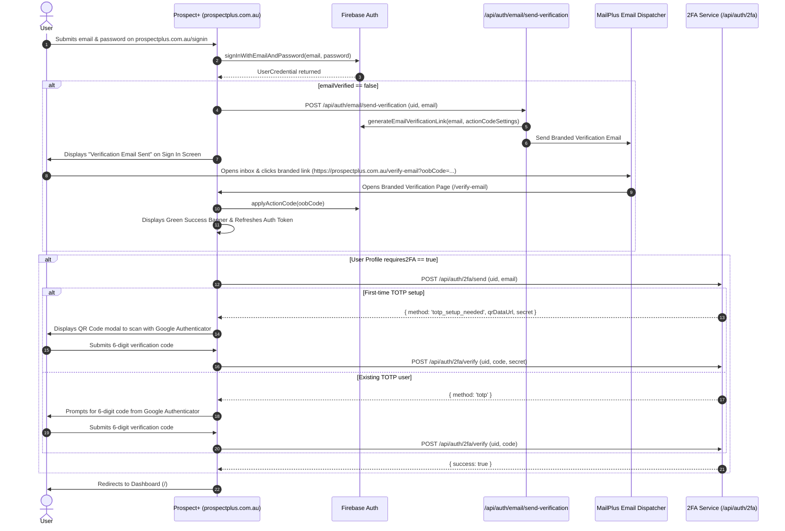
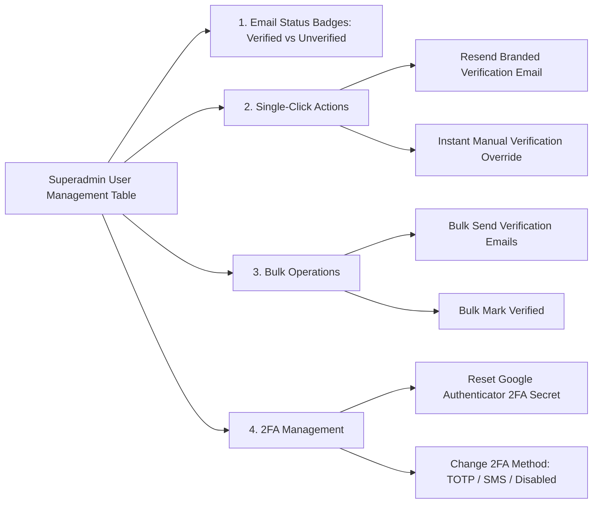

# Email Verification & 2FA Enforcement Workflow Plan

## 1. Overview & Objective
Starting Monday, any user attempting to log into Prospect+ whose email address has not been verified will automatically trigger an email verification challenge. 

They will receive a branded MailPlus verification email containing a clean link on **`prospectplus.com.au`**. Upon clicking the link, they land on a fully branded **Prospect+ Email Verification Page**, their email status is validated, and they automatically progress to the **2FA challenge** (QR Code setup for first-time users or 6-digit Google Authenticator code for existing users).

---

## 2. Authentication Flow & State Transitions



---

## 3. Superadmin Controls in User Management

In the **Superadmin User Management Dashboard** (`/admin/users`), Superadmins have full visibility and administrative control over the email verification and 2FA lifecycle:



### Specific Superadmin Capabilities:

| Feature / Action | Description | Benefit |
| :--- | :--- | :--- |
| **Email Verification Badges** | Visual status badge on each user row: <br>• 🟢 **Verified** (`emailVerified: true`)<br>• 🟡 **Pending Verification** (`emailVerified: false`) | Instant visibility into team security compliance. |
| **Status Filter Tab** | Filter the table by **All**, **Verified Only**, or **Unverified Only**. | Quick identification of users who haven't completed onboarding. |
| **Resend Verification Email** | Action icon (`MailCheck`) to immediately generate & dispatch a fresh branded verification email to the user. | Supports employees who lost their link or let it expire. |
| **Manual Instant Verification Override** | Action to immediately set `emailVerified: true` via Admin SDK without waiting for email delivery. | Unblocks staff during urgent onboarding or phone support. |
| **Bulk Verification Dispatch** | Multi-select checkboxes to send branded verification emails to all unverified users in one click. | Seamless rollout on Monday across the entire company. |
| **2FA Secret Reset** | Reset Google Authenticator for a user if they lose their phone or get a new device. | Allows user to re-scan the QR code on next login. |
| **2FA Method Switching** | Toggle 2FA enforcement between **Google Authenticator (TOTP)**, **SMS OTP**, or **Disabled**. | Granular policy control per user or role. |

---

## 4. URL Structure & Domain Configuration

### Custom Domain Link
The verification link will use your production domain:

```
https://prospectplus.com.au/verify-email?oobCode=<SECURE_OOB_CODE>&mode=verifyEmail
```

---

## 5. The Branded Verification Email (Inbox View)

Per MailPlus project formatting rules, the email uses a table-based layout with inline CSS, standard navy header `#095c7b`, official MailPlus asset logo, and standardized footer:

- **Sender:** `Prospect+ by MailPlus <no-reply@mailplus.com.au>`
- **Subject:** `Verify your email address for Prospect+`
- **Call-to-Action Link:** `https://prospectplus.com.au/verify-email?oobCode=...`

---

## 6. The Branded Landing Page (`/verify-email`)

When the user clicks the link in their email, they land on a branded web page built to match the Prospect+ design system:

### Visual Layout:
- **Header:** MailPlus Navy `#095c7b` Brand Header with the MailPlus Logo.
- **Card Container:** Clean white rounded container with subtle border & shadow.
- **Dynamic Status Indicator:**
  - **Verifying State:** Animated spinner with *"Verifying your email address with Prospect+..."*
  - **Success State:** Green badge & checkmark icon: *"Email Verified Successfully!"*
  - **Expired / Error State:** Amber alert: *"This verification link has expired or has already been used."* with a *"Request New Verification Email"* button.
- **Continuation Button:** *"Proceed to Two-Factor Authentication &rarr;"*

---

## 7. Two-Factor Authentication (2FA) Continuation

Once verified, the user immediately progresses to the Two-Factor Authentication phase:

### Case A: First-Time Setup (`totp_setup_needed`)
1. The 2FA dialog automatically opens in setup mode.
2. A unique **QR Code** and secret key are rendered on screen.
3. The user opens **Google Authenticator** (or compatible authenticator app), scans the QR code, and types the resulting 6-digit code.
4. On submission, the backend permanently binds the secret to the user profile and marks `totpConfirmed: true`.

### Case B: Existing 2FA User (`totp`)
1. The 2FA dialog prompts for the 6-digit code.
2. The user enters their current Google Authenticator code.
3. Once verified, session storage flag `2fa_verified_<uid>` is established and the user lands on the Prospect+ homepage.

---

## 8. Implementation Checklist & Files
- [ ] **Admin Verification Status API:** `/src/app/api/admin/users/email-verification/route.ts` (GET audit list, POST manual verify, POST resend).
- [ ] **Email Dispatcher API:** `/src/app/api/auth/email/send-verification/route.ts` with custom MailPlus HTML template and `prospectplus.com.au` link generation.
- [ ] **Branded Landing Page:** `/src/app/verify-email/page.tsx` with verification logic and direct bridge to 2FA / signin.
- [ ] **SignIn Hook & Gate:** Update `src/hooks/use-auth.tsx` & `src/app/signin/page.tsx` to detect `!user.emailVerified` on login, dispatch the email, and show the pending verification state.
- [ ] **Superadmin User Table UI:** Add verification badge, filter tabs, "Resend Verification Email" button, and "Manual Verify Override" action to `src/components/admin/user-management-table.tsx`.
