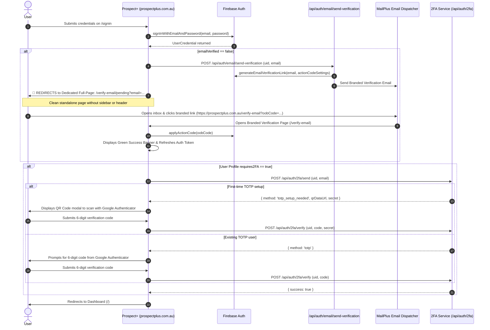

# Email Verification & 2FA Enforcement Workflow Plan

## 1. Overview & Objective
Starting Monday, any user attempting to log into Prospect+ whose email address has not been verified will automatically trigger an email verification challenge. 

Instead of showing a modal popup on the login screen, **the user is immediately redirected to a dedicated, full-screen branded page (`/verify-email/pending`)**. 

From there, they check their inbox, click the clean link on **`prospectplus.com.au`**, get verified on the **Branded Landing Page (`/verify-email`)**, and progress seamlessly to **Two-Factor Authentication (Google Authenticator 2FA)**.

---

## 2. Updated Authentication Flow & Full-Page Navigation

---

## 3. Dedicated Verification Pending Page (`/verify-email/pending`)

### Layout & Appearance
* **No Sidemenu & No Header:** Rendered as a standalone, distraction-free authentication experience.
* **Header Banner:** MailPlus Navy `#095c7b` with inverted white logo.
* **Visual Graphic:** Circular mail envelope badge.

---

### Page Copy & Elements

#### **Top Header**
* **Brand:** MailPlus Logo
* **Subtitle:** `PROSPECT+ SECURITY & VERIFICATION`

#### **Main Card Content**
* **Title:** **Check Your Inbox**
* **Subtitle:** Email Verification Required
* **Body Text:**
  > We've sent a secure verification link to your email address:
* **Highlighted Email Pill:**
  > `[ user@mailplus.com.au ]` *(bold, high-contrast container)*

#### **Step-by-Step Instructions Box**
> **How to continue:**
> 1. **Open your inbox** and locate the email from **Prospect+ by MailPlus**.
> 2. **Click the "Verify Email Address" button** in the message.
> 3. **Complete Two-Factor Authentication** to finish signing in to Prospect+.

#### **Actions & Controls**
* **Primary Resend Button:**
  * Active: **"Resend Verification Email"**
  * Cooldown: **"Resend in 30s"** *(with countdown spinner)*
* **Secondary Link:**
  * **"&larr; Sign in with a different account"** (returns to `/signin`)

#### **Help & Troubleshooting Footer**
> *Didn't receive the email? Check your junk or spam folder, or contact [MailPlus IT Support](mailto:mailplusit@mailplus.com.au).*

---

## 4. The Branded Verification Email (Inbox View)

Per MailPlus outbound email formatting rules:
- **Sender:** `Prospect+ by MailPlus <mailplusit@mailplus.com.au>`
- **Subject:** `Verify your email address for Prospect+`
- **Call-to-Action Link:** `https://prospectplus.com.au/verify-email?oobCode=...`

---

## 5. The Branded Landing Page (`/verify-email`)

When the user clicks the link in their email:
- Opens `https://prospectplus.com.au/verify-email?oobCode=...`
- Clean standalone layout (no header/sidebar).
- Validates code via `applyActionCode(auth, oobCode)`.
- Green checkmark: **"Email Verified!"**
- CTA Button: **"Continue to Sign In & 2FA &rarr;"**

---

## 6. Two-Factor Authentication (2FA) Continuation

* **First-Time Setup (`totp_setup_needed`):** Displays QR code to scan with Google Authenticator + enter 6-digit confirmation code.
* **Returning Users (`totp`):** Prompts for 6-digit Google Authenticator code.

---

## 7. Superadmin Controls in User Management

In `/admin/users`, Superadmins can:
1. View live 🟢 **Verified** and 🟡 **Pending** status badges.
2. Filter users by verification status.
3. Click **Resend Verification Email** for any pending user.
4. Click **Manual Verification Override** to immediately verify an account without waiting for email delivery.
5. Perform **Bulk Resend** and **Bulk Verify**.

---

## 8. Implementation Checklist
- [ ] Create `/src/app/verify-email/pending/page.tsx` with dedicated copy, resend timer, and clean standalone styling.
- [ ] Update `src/app/app-layout.tsx` to include `/verify-email/pending` in standalone exclusions.
- [ ] Update `src/app/signin/page.tsx` so that when `requiresEmailVerification: true` is returned, it executes `router.push('/verify-email/pending?email=' + encodeURIComponent(email))` instead of opening a modal.
- [ ] Verify seamless transition from `/verify-email` -> `/signin?verified=true` -> 2FA.
