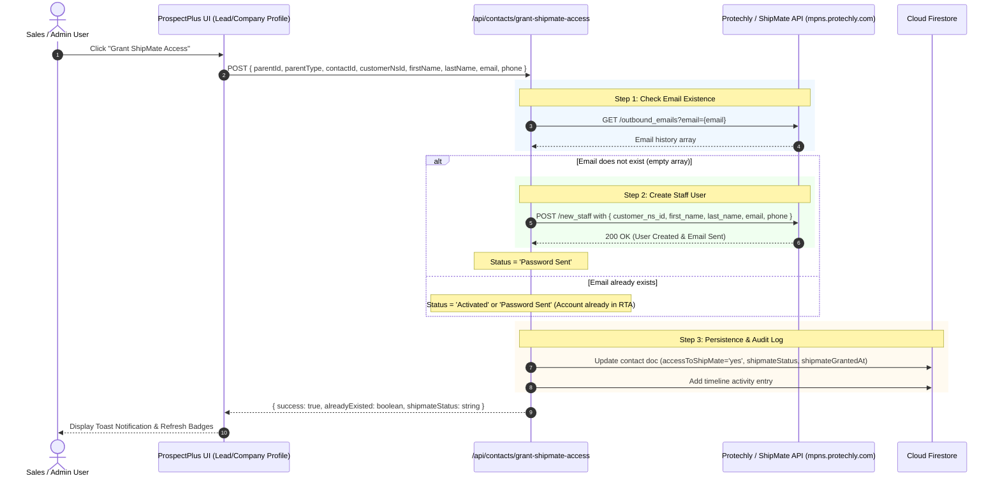

# Grant ShipMate Access Implementation Plan

This document outlines the architecture, API integrations, and UI implementation plan for granting ShipMate portal access to contacts in ProspectPlus.

---

## 1. Overview & Objectives

Provide a seamless process for users (Sales, Admin, Account Managers) to grant ShipMate access to a contact directly from Lead and Company profiles.

The integration:
1. Performs a pre-flight existence check against Protechly API to see if the contact's email is already registered.
2. If **not found**, calls the Protechly `POST /new_staff` endpoint to create the staff user and trigger the password setup email.
3. If **already exists**, links the existing account without throwing an error.
4. Updates Firestore contact attributes (`accessToShipMate`, `shipmateStatus`, `shipmateGrantedAt`, `shipmateCheckedAt`).
5. Logs an audit timeline event on the Company/Lead record.

---

## 2. API Specifications

### 2.1 Common Request Headers
* **`Content-Type`**: `application/json`
* **`Accept`**: `application/json`
* **`x-api-key`**: `XAZkNK8dVs463EtP7WXWhcUQ0z8Xce47XklzpcBj`

---

### 2.2 Step 1: Pre-flight Existence Check
* **Method**: `GET`
* **Endpoint**: `https://mpns.protechly.com/outbound_emails?email={contactEmail}`
* **Logic**:
  * **Email Exists**: Returns a non-empty array of sent email objects (e.g. password set or welcome emails).
  * **Email Does Not Exist**: Returns an empty array `[]` or 404.

---

### 2.3 Step 2: Create Staff User in RTA
* **Method**: `POST`
* **Endpoint**: `https://mpns.protechly.com/new_staff`
* **Condition**: Executed only if Step 1 determined the email does not exist.
* **Payload Structure (`userJSON`)**:
  ```json
  {
    "customer_ns_id": "<custInternalID>",
    "first_name": "<contactFirstName>",
    "last_name": "<contactLastName>",
    "email": "<contactEmail>",
    "phone": "<contactPhone>"
  }
  ```

* **Field Mapping & Fallbacks**:
  | Field | Primary Source | Fallback Source |
  | :--- | :--- | :--- |
  | `customer_ns_id` | `company.internalid` / `lead.internalid` | `lead.netsuiteId` / `lead.id` |
  | `first_name` | `contact.firstName` | `contact.name.split(' ')[0]` |
  | `last_name` | `contact.lastName` | `contact.name.split(' ').slice(1).join(' ')` or `'-'` |
  | `email` | `contact.email.trim().toLowerCase()` | `lead.customerServiceEmail` / `lead.email` |
  | `phone` | `contact.phone.trim()` | `lead.customerPhone` / `lead.phone` / `''` |

---

## 3. Architecture & Execution Flow



---

## 4. Implementation Tasks

### 4.1 Backend API Endpoint
* **Path**: `src/app/api/contacts/grant-shipmate-access/route.ts`
* **Key Responsibilities**:
  1. Input validation & sanitization (trim emails, clean phone numbers).
  2. Perform `GET /outbound_emails` check.
  3. Execute `POST /new_staff` when email is absent.
  4. Update Firestore subcollection: `[companies|leads]/{parentId}/contacts/{contactId}`.
  5. Append activity log to the parent record.
  6. Return standard response envelope with granular status.

---

### 4.2 Frontend Integration (Lead & Company Profiles)
* **Target Files**:
  * `src/components/company-profile.tsx`
  * `src/components/lead-profile.tsx`
* **Changes**:
  1. Add **"Grant ShipMate Access"** action button alongside the existing **"Check ShipMate"** button on contact cards.
  2. Implement `handleGrantShipmateAccess(contact)` with loading indicator state (`grantingShipmateId`).
  3. Provide distinct user feedback:
     * *New account created*: "ShipMate access granted. A password creation email has been dispatched to {email}."
     * *Existing account detected*: "Contact is already registered in ShipMate. Status synced successfully."
  4. Real-time badge update (`ShipMate Activated` | `ShipMate Password Sent`).

---

### 4.3 Dialog & Modal Integrations
* **Target Files**:
  * `src/components/shipmate-access-dialog.tsx`
  * `src/components/add-contact-form.tsx`
  * `src/components/edit-contact-form.tsx`
* **Changes**:
  1. Refactor `ShipMateAccessDialog` to iterate over selected contacts and call `/api/contacts/grant-shipmate-access`.
  2. Add optional trigger in Add/Edit Contact forms when toggling `accessToShipMate`.

---

## 5. Edge Cases & Error Handling

1. **Missing Customer NetSuite ID**:
   * Attempt resolution from `internalid` -> `netsuiteId` -> `document ID`.
   * Return clear validation warning if NetSuite sync is required beforehand.
2. **First/Last Name Splitting**:
   * Ensure single-word names (e.g. "Alex") safely produce `first_name: 'Alex'` and `last_name: '-'` without throwing undefined errors.
3. **API Rate Limiting / Gateway Timeout**:
   * Wrap external fetch calls in try/catch blocks with 15-second timeouts.
   * Provide friendly error messages in toasts if Protechly endpoints are unreachable.
